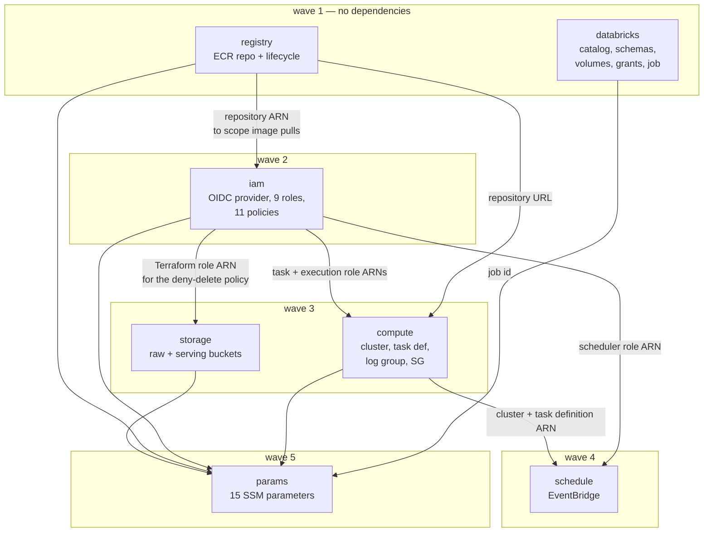

# Resources

Every resource this repo manages, what it is for, and who consumes it.
Generated from live `terraform state list`, not from the configuration — so it
reflects what actually exists.

**71 managed resources across 7 modules.** The root module holds none: it has 5
data sources and 7 `module` blocks, and a test fails the build if a `resource`
appears there.

---

## Why 71 is not 71 separate decisions

Three multipliers account for most of the count:

| Source of inflation | Count |
|---|---|
| S3's decomposed API — versioning, encryption, public-access block, lifecycle and policy are each their own resource, × 2 buckets | 12 |
| SSM parameters (the published interface) | 15 |
| `for_each` over 5 repos — OIDC roles, wheel-read policies, role-ARN parameters | 15 |
| **Everything else — the actual infrastructure** | **29** |

---

## Dependency graph

`databricks` is entirely independent of the AWS chain and completes in parallel
with all of it. That is deliberate, and the same principle as repo 5 having no
runtime Databricks dependency: the two halves of this project are decoupled.

### Two cycles, broken on purpose

IAM must grant access to a log group and task definition that `compute` creates,
and `storage`'s bucket policy needs IAM's Terraform role ARN. Naively that is
`iam → compute → iam` and `storage → iam → storage`.

The fix is that `iam` accepts **names**, not ARNs — `log_group_name`,
`ecs_family`, `ecs_cluster`, `raw_bucket` — and constructs the ARNs itself from
the account and region. Those names are deterministic locals in the root module,
so they are knowable before the resources exist. That is why IAM can be built in
wave 2 while the things it grants access to appear in waves 3 and 4.

---

## storage — 14 resources

The raw zone is the system of record; immutability is what makes "replay from
landing" a meaningful claim rather than a hope.

| Resource | Purpose |
|---|---|
| `aws_s3_bucket.raw` | Landing zone. Repo 3 writes, repo 4's Auto Loader reads |
| `aws_s3_bucket_policy.raw` | **Denies `DeleteObject`/`DeleteObjectVersion` to every principal except the Terraform role**, and denies non-TLS access |
| `aws_s3_bucket_versioning.raw` | Second line of defence behind the deny |
| `aws_s3_bucket_server_side_encryption_configuration.raw` | AES256 at rest |
| `aws_s3_bucket_public_access_block.raw` | All four flags true |
| `aws_s3_bucket_lifecycle_configuration.raw` | STANDARD_IA at 90d; expire noncurrent at 90d |
| `aws_s3_bucket.serving` | Parquet export. Repo 4 writes, repo 5 reads |
| `aws_s3_bucket_policy.serving` | TLS-only, plus read for repo 5's role. **Not public** — the API reads it with credentials |
| `aws_s3_bucket_versioning.serving` | Short rollback window on an overwrite-only export |
| `aws_s3_bucket_server_side_encryption_configuration.serving` | AES256 |
| `aws_s3_bucket_public_access_block.serving` | All four flags true |
| `aws_s3_bucket_lifecycle_configuration.serving` | Expire noncurrent at 30d |

## iam — 21 resources

Nothing else in this repo can act without these; every other module's resources
are reached by one of these identities.

| Resource | Purpose |
|---|---|
| `aws_iam_openid_connect_provider.github[0]` | Keyless CI auth. Account-level singleton — set `create_github_oidc_provider = false` if one already exists. No `thumbprint_list`: AWS validates GitHub against a trusted root CA and ignores it |
| `aws_iam_role.terraform` + policy | Provisioning identity, and the **only** principal permitted to delete from the raw zone |
| `aws_iam_role.ingest_task` + policy | Repo 3's container. `s3:PutObject` on the raw prefix only — not `s3:*`, not the bare bucket ARN, and no `DeleteObject` |
| `aws_iam_role.ingest_execution` + policy | ECS agent: scoped ECR pull, secret injection, logs. Deliberately **no** `AmazonECSTaskExecutionRolePolicy`, which would re-grant those on `Resource: "*"` |
| `aws_iam_role.scheduler` + policy | EventBridge: `ecs:RunTask` on the family, `iam:PassRole` conditioned on `ecs-tasks.amazonaws.com` |
| `aws_iam_role.oidc[×5]` | One CI role per repo, `sub`-scoped to `repo:Dark417/<name>:*` |
| `aws_iam_role_policy.infra_ci_assume` | Repo 2's CI assumes the Terraform role rather than carrying rights itself |
| `aws_iam_role_policy.ingest_ci` | Repo 3 pushes images |
| `aws_iam_role_policy.config_reader[×3]` | SSM read for repos 1, 4, 5. Repos 2 and 3 get it via their own policies |
| `aws_iam_role_policy.wheels_read[×5]` | Every repo installs the contracts wheel from `s3://<state-bucket>/wheels/` |
| `aws_iam_role_policy.wheels_write` | Repo 1 publishes it. No `DeleteObject` — a published version is immutable |

## params — 15 resources

The published interface. Repos 3–5 read config here at runtime rather than
hardcoding ARNs; SSM rather than `terraform_remote_state` because remote state
would grant every consumer read access to every output.

| Parameter | Consumed by |
|---|---|
| `/edgar-lakehouse/dbx/host` | repos 1, 4, 5 |
| `/edgar-lakehouse/dbx/volume_path` | repos 3, 4 |
| `/edgar-lakehouse/dbx/warehouse_id` | repos 1, 5 |
| `/edgar-lakehouse/dbx/job_id` | repo 4 |
| `/edgar-lakehouse/s3/raw_bucket` | repos 3, 4 |
| `/edgar-lakehouse/s3/serving_bucket` | repos 4, 5 |
| `/edgar-lakehouse/ecr/ingest_repo` | repo 3 CI |
| `/edgar-lakehouse/ecs/task_family` | repo 3 CI |
| `/edgar-lakehouse/contracts/version` | repos 3, 4, 5 |
| `/edgar-lakehouse/landing_mode` | repos 3, 4 (ADR-001) |
| `/edgar-lakehouse/iam/oidc_role_arn/<repo>` ×5 | Humans, populating GitHub variables |

> The five role-ARN parameters are the weakest entry here: CI must *assume* its
> role before it can read SSM, so it can never look up its own ARN. They exist
> for the operator running `get-parameters-by-path`. Kept because §10 names them
> and Standard parameters are free, but they would be the first thing to cut.

## databricks — 11 resources

Terraform owns the **containers**. Tables belong to Liquibase in repo 1; there
are no table resources here and CI fails the build if one appears.

| Resource | Purpose |
|---|---|
| `databricks_catalog.this` | `edgar`. Imported, not created. `ignore_changes` on `storage_root` — without it, a plan proposes replacement and would drop all 13 tables |
| `databricks_schema.this[×4]` | `landing`, `bronze`, `silver`, `gold`. Imported |
| `databricks_volume.landing_edgar` | Landing transport. Imported |
| `databricks_volume.wheels` | Repo 4's private wheel needs a readable path |
| `databricks_grants[×3]` | Catalog and both volumes. `count`-gated: UC needs an **account-level** principal, and workspace groups `admins`/`users` do not resolve |
| `databricks_job.daily` | The 6-task medallion DAG. Created **PAUSED** |

## compute — 5 resources

| Resource | Purpose |
|---|---|
| `aws_ecs_cluster.this` | Namespace. Free — clusters cost nothing idle |
| `aws_ecs_task_definition.ingest` | 0.5 vCPU / 1 GB, image pinned by digest, secrets via `valueFrom` |
| `aws_cloudwatch_log_group.ingest` | 14-day retention. The default is never-expire, which is a slow bill |
| `aws_security_group.task` | **No ingress rules at all** |
| `aws_vpc_security_group_egress_rule.https` | 443 out, for sec.gov, S3, Secrets Manager and SSM |

## registry — 2 resources

| Resource | Purpose |
|---|---|
| `aws_ecr_repository.ingest` | IMMUTABLE tags + scan-on-push. Immutability pairs with digest pinning |
| `aws_ecr_lifecycle_policy.expire_old_images` | Retention count is a **variable**, not part of the resource name — renaming it once created and then destroyed the same underlying object, leaving no policy at all |

## schedule — 1 resource

| Resource | Purpose |
|---|---|
| `aws_scheduler_schedule.daily` | `cron(0 6 * * ? *)` UTC, flexible window OFF so the logical date is deterministic. Created **DISABLED** |

---

## Not managed here

| Thing | Owner |
|---|---|
| The 13 tables | Liquibase, repo 1 |
| Repo 5's hosting | Repo 5 deploys itself to Fly.io |
| Secret **values** | Created by hand; referenced as data sources so plaintext never enters state |
| State bucket | Bootstrap. Terraform cannot create the bucket holding its own state |

State locking needs no resource at all: the backend uses `use_lockfile = true`,
which takes the lock by conditionally writing a `.tflock` object beside the
state file. The DynamoDB table this replaced has been deleted.
